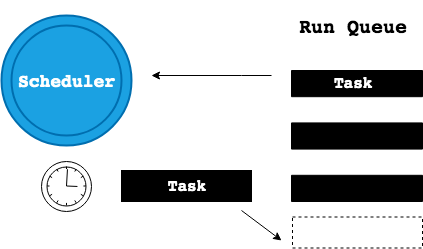
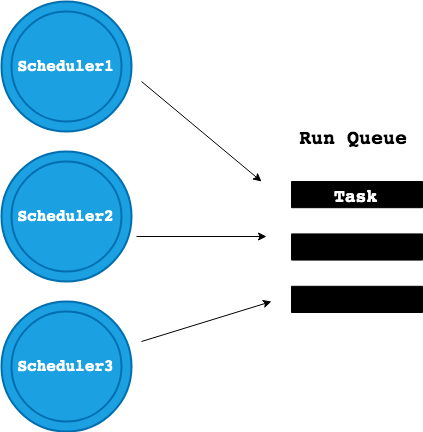

# Elixir, The Beam and You: How Elixir Concurrency Really Works

Elixir has become famous as the shiny new "concurrent" programming language, with more and more former OO devotees flocking to it every day. But what actually makes Elixir concurrent? To find out, we need to understand OTP and the Erlang VM.

# I Don't Understand Concurrency

Coming to Elixir from a Ruby and JS background, I understood that concurrency was something I wanted in a language. However, even after several years of programming Elixir, I didn't really understand *how* it operates concurrently. I had heard of the BEAM and worked with OTP but I would be hard-pressed to give more than a passing definition of either.

Many "career-change" programmers––those of us who came to coding without a CS degree––learn by getting our hands dirty. We build things. As a result, we can sometimes take for granted *how* something works, and remain satisfied by the fact that it *does* work. Add to that the difficulty of and even embarrassment around asking "stupid" questions, and you end up with me––someone who has programmed code that runs "on" the BEAM, but can't tell you what the BEAM is.

Over the past few weeks, my curiosity about the foundations of Elixir has grown. The passing of Joe Armstrong, the creator of Erlang, inspired me to learn more about his work while Bruce Tate and James Edward Gray's beta release of their book [*Designing Elixir Systems with OTP*](https://pragprog.com/book/jgotp/designing-elixir-systems-with-otp) got me thinking about what OTP *really* means.

Keep reading if you want to stop bragging about the fact that Elixir is concurrent, and start understanding *how* it enacts that concurrency.

# What is the BEAM?

[The BEAM (Bogdan Erlang Abstract Machine) is the Erlang virtual machine)](https://en.wikipedia.org/wiki/BEAM_(Erlang_virtual_machine). In this post, we'll refer to BEAM and Erlang VM interchangeably.

The BEAM compiles Erlang *and* Elixir code into bytecode (the `.beam` files you may have noticed in your compiled Elixir applications) and executes it.

# The BEAM and OTP

In order to talk about the BEAM, we need to talk about OTP.

> OTP is a set of Erlang libraries, which consists of the Erlang runtime system, a number of ready-to-use components mainly written in Erlang, and a set of design principles for Erlang programs.[*](https://github.com/erlang/otp)

In fact, in order to install and use Erlang on your machine, you will [install and build an Erlang/OTP distribution](http://erlang.org/doc/installation_guide/INSTALL.html#how-to-build-and-install-erlang-otp).

OTP provides modules and behaviours that represent standard implementations of common practices like process supervision, message passing, spawning tasks, etc. For example, the OTP framework's definition of the GenServer behaviour is an abstraction of common uses of/interactions with certain types of processes. So, instead of rolling your own server and re-inventing the wheel with every new application, all of us Erlang and Elixir programmers can subscribe to a shared, mature and battle-tested server interface by using the GenServer module and behaviour.

OTP also encompasses the Erlang Run Time System (ERTS). That means that the OTP framework includes the BEAM. So, when we talk about the BEAM, we are talking about a virtual machine built into the OTP distribution.

# The Beam and Parallel Processing

As part of the ERTS, the BEAM is responsible for scheduling Erlang processes. This is where the concurrency magic happens.

The BEAM uses one OS thread per core. It runs a scheduler on each of these threads. Each scheduler pulls processes to run from its very own run queue. The BEAM is also responsible for populating these run queues with Erlang processes to execute. In order to understand just how cool this is, we need to understand Erlang's relationship to concurrency.

## Concurrency and the Creation of Erlang

The Erlang programming language was developed by Joe Armstrong and others working out of Ericsson's CS lab in 1986. Ericsson built and maintained large telephone exchanges with hundreds of thousands of users. These systems had an important requirement: they could never fail. They had to be completely fault-tolerant. As Joe dove into developing massive, fault-tolerant systems, he saw that a feature of these systems was concurrency.

> Initially, I wasn’t really interested in concurrency as such, I was interested in how you make fault-tolerant systems. A characteristic of these systems were that they handle hundreds of thousands of telephone calls at the same time.[*](https://www.erlang-solutions.com/blog/let-s-talkconcurrency-with-joe-armstrong.html)

Having recognized this characteristic, he began to conceptualize "Concurrency Oriented Programming"––a way of modeling applications that mirrors the world around us.

> The world is parallel. If we wish to write programs that behave as other objects behave in the real world then these programs will have a concurrent structure...People function as independent entities that communicate by sending messages. That's how Erlang processes work...Erlang programs are made up of lots of little processes all chattering away to each other - just like people.[*](http://armstrongonsoftware.blogspot.com/2006/08/concurrency-is-easy.html)

With this model in mind, Erlang was developed to be fault tolerant and *concurrent*. But what does it really mean for a language to be "concurrent"?

## The History of Multi-Core Processing and The Beam

Before Intel released the Core 2 Quad processor in 2007, computer chips contained one single core. A core is part of a CPU that receives instructions and performs actions based on those instructions.

In the single-core world, computers had the ability to execute processes concurrently, but not in parallel. But wait! Aren't "concurrent" and "parallel" the same thing? Nope!

Let's imagine we're doing something we hate, like two enormous loads of laundry. We sort our darks from our lights and head to the laundromat. Laundry is the worst and takes forever so we want to try to maximize our time at the laundromat. Instead of doing each load of laundry synchronously (load the darks, add the detergent, put in the coins, press "start", wait for the cycle to finish, put the laundry in the dryer, repeat with the lights load), we decide to do both loads of laundry at the same time.

We load the darks in one machine and the lights in the other. We add the soap to one machine and then to the other, we add the coins to one machine and then the other and we press "start" on one machine and then the other. This represents a **concurrent** set of processes––both the dark load of laundry and the light load of laundry are in the same state at the same time. BUT this happened as a result of us quickly switching back and forth between each process (performing a single step of the process for the dark load and then the light load).

[laundry diagram concurrent, 1 panel]

In this concurrent, one-core world, The Erlang VM ran one one thread with one scheduler on the one available core. The scheduler plucked Erlang processes from the single run queue and allotted a "time slice" to each processes. If a process exceeded its "time slice", the Erlang VM would pause the process, put it back on the queue and move on to the next item on the list. In this way, the Erlang VM would execute Erlang processes "concurrently" by quickly switching back and forth between processes, just like we quickly switched back and forth between our loads of dark laundry and light laundry to wash the loads at roughly the same time.



With the advent of multi-core processors, the BEAM was able to utilize a [Symmetrical Multi Processor (SMP) in Erlang](http://erlang.org/euc/08/euc_smp.pdf). The first iteration of SMP in the Erlang VM came out with the release of Erlang OTP R11B in 2006. This version of the Erlang VM could run anywhere from 1 to 1024 schedulers on one thread each, sharing the same run queue and running on the same single core.



With the release of OTP R12B in 2007, the Erlang VM running on a multi-core processor became capable of claiming one thread per core on which to run a scheduler. This allowed for the parallel running of Erlang processes as a set of schedulers across cores pulled from a shared run queue to execute processes. So, Erlang's existing ability to execute concurrent processes allowed it to immediately adapt to running parallel processes on multi-core computers.

To revisit our laundry analogy––imagine we are joined by a helpful friend who just *loves* doing laundry (thank god, also, who?). They show up to handle the dark load while we wash the lights. Now we are loading each set of laundry into two different machines *at the same time*. We've achieved **parallel processing**!

[laundry diagram, parallel, 1 panel]

We can see an indication of this capability in action by starting an `iex` shell on our machines:

```
$ iex
Erlang/OTP 21 [erts-10.0.4] [source] [64-bit] [smp:4:4] [ds:4:4:10] [async-threads:1] [hipe] [dtrace]

Interactive Elixir (1.7.2) - press Ctrl+C to exit (type h() ENTER for help)
iex(1)>
```

This portion of the prompt `[smp:4:4]` indicates that my machine has four available cores, with four schedulers available, one on each core.

This second iteration of SMP on the Erlang VM was limited by the fact that the set of parallel schedulers running across cores still shared the same run queue. The data in the queue had to locked to avoid contamination.

This had the potential to create processing bottlenecks--where one slow running process or lock conflict arose, *all* of the schedulers waiting to access the run queue would be delayed. For example, if you and your weird laundry-loving friend are sharing the detergent bottle, one person's reach for the detergent will prevent the other from moving forward with the next step of the laundry load process.

[laundry diagram - waiting for detergent]

This issue was resolved by the release of OTP R13B, which moved away from the common run queue and implemented dedicated run queues per thread per core. Today, the Erlang VM runs on one thread on each core. Each thread runs its own scheduler that pulls from its very own run queue. Data is *not* shared across queues so there is no need to manage locking. Everyone gets their own laundry to load and their own bottle of detergent to use!


## How Does the BEAM Manage Parallel Processes?

The BEAM creates a thread per core, a scheduler per thread and a run queue per scheduler. It is also responsible for populating all of the run queues with processes for the schedulers to execute in parallel. This is managed by the BEAM's [Load Balancer](https://blog.stenmans.org/theBeamBook/#_load_balancing). The load balancer implements [migration logic](http://www.erlang-factory.com/upload/presentations/105/KennethLundin-ErlangFactory2009London-AboutErlangOTPandMulti-coreperformanceinparticular.pdf) to allocate processes between the run queues on the separate cores. This logic helps the load balancer take jobs away from overloaded queues ("task stealing") and give them to empty or underloaded ones ("task migration"). The load balancer aims to keep the maximum number of run-able processes equal across schedulers.

[diagram- multiple schedulers, multiple queues + LB]

# Conclusion


### Resources
* https://en.wikipedia.org/wiki/BEAM_(Erlang_virtual_machine)
* https://github.com/erlang/otp
* https://learnyousomeerlang.com/what-is-otp#its-the-open-telecom-platform
* https://www.erlang-solutions.com/blog/let-s-talkconcurrency-with-joe-armstrong.html
* http://erlang.org/euc/08/euc_smp.pdf
* https://learnyousomeerlang.com/the-hitchhikers-guide-to-concurrency
* https://blog.stenmans.org/theBeamBook/#_load_balancing
* http://www.erlang-factory.com/upload/presentations/105/KennethLundin-ErlangFactory2009London-AboutErlangOTPandMulti-coreperformanceinparticular.pdf
