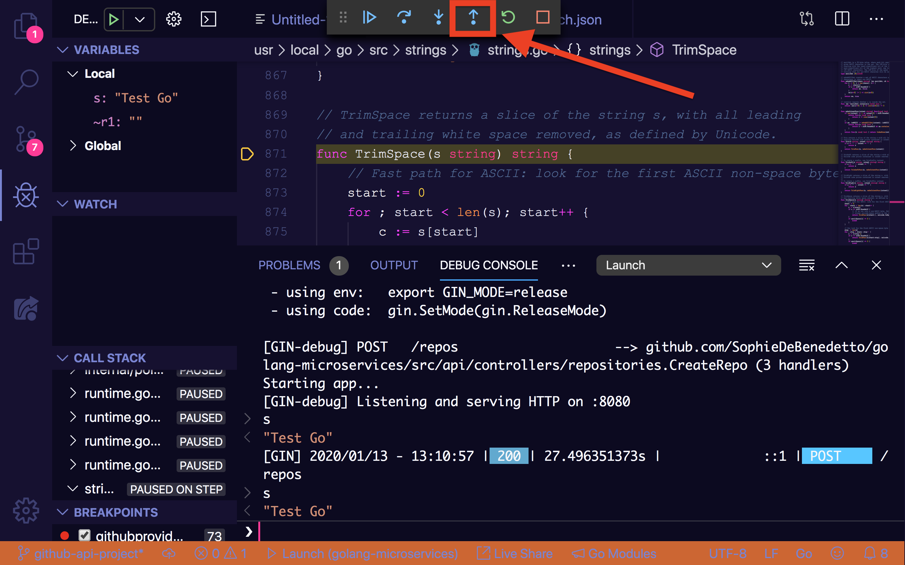

I found that using Delve to debug a Golang web app was fairly non-intuitive. Keep reading to find out how its done!

## What is Delve?

[Delve](https://github.com/go-delve/delve) is the Golang debugger. It allows us to add breakpoints to our code, run that code and be dropped into an interactive console in which we can interact with that code at runtime. It's the `binding.pry` of the Golang world.

## Getting Started

### Install Go Extensions for VSCode

Make sure you've installed the [Go extensions for VSCode](https://marketplace.visualstudio.com/items?itemName=ms-vscode.Go).
Once you've done that, you're ready to install Delve!

### Install Delve Package

You can check out the installation guides here, but for installing on OSX, simply install the package with:

```bash 
`go get` -u github.com/go-delve/delve/cmd/dlv 
```

Installation should be as simple as that, but I ran into a few "gotchas". Keep reading to avoid my mistakes ;)

### Gotcha #1: Don't Install via VSCode Command Palette

First off, when I first googled around for "how to install delve in VSCODE", I came across [this little bit of of official Microsoft/VSCode documentation](https://github.com/Microsoft/vscode-go/wiki/Debugging-Go-code-using-VS-Code). This doc instructs you to install `dlv` via the `Go: Install/Update Tools` command in the command palette. Although this command did not fail for me, it did not actually allow me to successfully run my code in debug mode. Having run only this command, rather manually installing Delve via `go get`, I saw the following error when trying to launch the debugger:


However, I was able to run the debugger after installing Delve via `go get` and without adding the dlv tools from the `Go: Install/Update Tools` command.

Tl;Dr ignore the instructions in the offical Microsoft/VSCode docs!

## Gotcha #2: `dlv command not found`
Once you install the Delve package with `go get`, try running `dlv` from the command line. You should see the following:

```bash
// ♥ dlv
Delve is a source level debugger for Go programs.

Delve enables you to interact with your program by controlling the execution of the process,
evaluating variables, and providing information of thread / goroutine state, CPU register state and more.

The goal of this tool is to provide a simple yet powerful interface for debugging Go programs.

Pass flags to the program you are debugging using `--`, for example:

`dlv exec ./hello -- server --config conf/config.toml`

Usage:
  dlv [command]

Available Commands:
  attach      Attach to running process and begin debugging.
  connect     Connect to a headless debug server.
  core        Examine a core dump.
  debug       Compile and begin debugging main package in current directory, or the package specified.
  exec        Execute a precompiled binary, and begin a debug session.
  help        Help about any command
  run         Deprecated command. Use 'debug' instead.
  test        Compile test binary and begin debugging program.
  trace       Compile and begin tracing program.
  version     Prints version.

Flags:
      --accept-multiclient   Allows a headless server to accept multiple client connections.
      --api-version int      Selects API version when headless. (default 1)
      --backend string       Backend selection (see 'dlv help backend'). (default "default")
      --build-flags string   Build flags, to be passed to the compiler.
      --check-go-version     Checks that the version of Go in use is compatible with Delve. (default true)
      --headless             Run debug server only, in headless mode.
      --init string          Init file, executed by the terminal client.
  -l, --listen string        Debugging server listen address. (default "127.0.0.1:0")
      --log                  Enable debugging server logging.
      --log-dest string      Writes logs to the specified file or file descriptor (see 'dlv help log').
      --log-output string    Comma separated list of components that should produce debug output (see 'dlv help log')
      --wd string            Working directory for running the program. (default ".")

Additional help topics:
  dlv backend Help about the --backend flag.
  dlv log     Help about logging flags.

Use "dlv [command] --help" for more information about a command.
```

IF, however, you see:

```bash
dlv command not found 
```

It likely means that some of your Go-related ENV vars are not properly set up in your bash profile. Double check that you have the following:

```bash
export GOROOT=/usr/local/go
export GOPATH=/your/go/path
export PATH=$GOPATH/bin:$PATH
export PATH=$PATH:$GOROOT/bin
```

Source your bash profile and then try running `dlv` again. You should see the correct output now.
Now that we've sorted out some of the gotchas I at least encountered, we're ready to debug stuff!

## Let's Debug!

Torturous bugs got you down? Have you tried using the Brainalyzer™️ to take over their entire organization and destroy it?


Oops, I mean, have you tried using Delve? Let's take a look at how to use Delve to debug a Golang web app!

### Step 1. Add a Breakpoint
First up, we need to add a breakpoint to our code. We'll do so by clicking the little red circle that appears when you hover your mouse over the line number of a given line of code:


### Step 2. Configure the Debugger
Next, we configure our debugger to launch our app in "debug mode" by selecting the "debug" icon on the right hand panel, followed by clicking the "create launch.json file" option:


Fill our your `launch.json` file with the configuration for launching your Golang web app, including an env vars your app needs to run.

```json
{
    // Use IntelliSense to learn about possible attributes.
    // Hover to view descriptions of existing attributes.
    // For more information, visit: https://go.microsoft.com/fwlink/?linkid=830387
    "version": "0.2.0",
    "configurations": [
        {
            "name": "Launch",
            "type": "go",
            "request": "launch",
            "mode": "auto",
            "program": "${workspaceFolder}",
            "env": {"apiGithubAccessToken": "xxxxx"} // our app makes a call to the GH API and contains code that fetches this ENV var,
            "args": []
        }
    ]
}
```

Note that we've set the `"program"` attribute to `"${workspaceFolder}"`. The `$workspaceFolder` variable refers to the path to the open folder. In my case, the open folder is the folder that contains my web app, so this path is all we need to instruct Delve to run the appropriate app. Check out other available VSCode variables here.

Also note that we've populated the `"env"` property with any environment variables that our app needs to run. When running in debug mode, our app will not pick up env vars set in the local environment.

### Step 3. Run the App in Debug Mode
Now we're ready to launch out app in debug mode! Click the green "play" button to launch:


This launches our program by running the `main.go` file. In the case of our web app, our web server is now up and running––ready to accept requests on `http://localhost:8080`.

### Step 4. Interact with Your Code + The Debugger

We can hit our breakpoint by sending a web request to our app to trigger the code flow that includes that breakpoint.
Once we hit our breakpoint, we'll be dropped into the interactive debug console where we can play around with our code!

Use the forward/back pause, stop and up/down controls to step through your code.

The **"Up/Down**" buttons will move you into/out of any functions you have set a breakpoint on. Here we are stopped on a breakpoint on line 31, a line that calls `strings.TrimSpace(input.Name)`. We can interact with our program via the debug console, for example evaluating input.Name. And we can "step into" the `strings.TrimSpace` function by clicking the down arrow icon:


We are dropped into the execution of the `strings.TrimSpace` function, where once again we can use the debug console to interact with our code, in this case evaluating the `s` variable and seeing that it is set to `"Test Go"`.

We can exit this function by clicking the up arrow or "step out" function, which will bring us back to our breakpoint.



The **"Forward"** button will move you to the next line of code to be executed, as the code flow continues, allowing you to interact with the program's context at each step along the way.


The **"Play/Pause"** button will breakout of a breakpoint and continue code execution, stoping again when the next breakpoint is hit:


The **"Replay"** button will restart the app running from the beginning, breaking you out of whatever breakpoint you are on.

The **"Stop"** button will stop the process running, terminating the web server.

### Bonus: Managing Breakpoints

If you've set a number of different breakpoints throughout your app, it can be helpful to manage them all in one place. See them listed, activate/deactivate individual breakpoints and add/remove breakpoints from the breakpoint control panel:


### Bonus: Debugging Tests

Last but not least, let's take a brief look at how to debug individual tests in our test suite.

First, add a breakpoint anywhere in the code flow triggered by the run of a particular test––including in the test function itself.

Then, click on the "debug test" option that appears right about your test function definition:


The test will run and when your breakpoint is hit you can interact with your code and the debugger in the same way we described above.

### Conclusion

As a Golang n00b, it definitely took me a little while to get debugger up and running, and I'm still getting comfortable with all of the things it can do. Hope this resource proves helpful to you on your own Go journey. Happy coding!