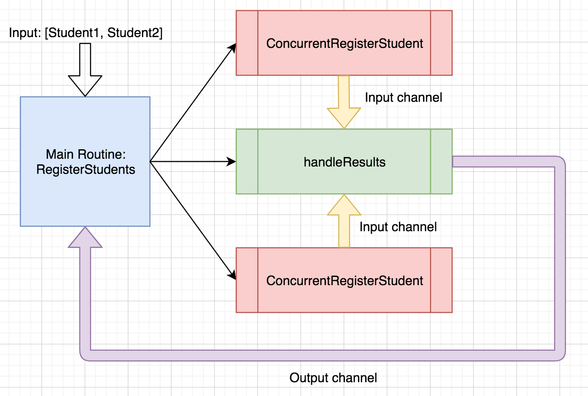

Go provides robust support for concurrent programming. Using goroutines and channels, we can ensure that our program works on more than one task in a given time period. This is perfect for scenarios in which we need to process large sets of data in a timely manner and report on the results of this processing back to the caller.

In this post, we'll use goroutines, channels and WaitGroups to process a "bulk user registration" request.

This post was inspired by my learnings from Federico León's course, [Golang: The Ultimate Guide to Microservices](https://www.udemy.com/course/golang-the-ultimate-guide-to-microservices-in-go-part-1/) available on Udemy.

## Concurrency is NOT Parallelism!

Before we get started, I'd like to call out an important distinction. When we talk about "concurrent programming", the words "concurrent" and "parallel" are often used interchangeably. However, they are NOT the same!

**Concurrent** code means that our program can work on more than one task within a given time period. How? By leveraging concurrent programing tools (in our case, goroutines and channels), the CPU will be instructed to switch between the execution of a set of tasks until all of the tasks are completed. The CPU can achieve this by allotting a certain time period to each task before moving on to the next, cycling back to any unfinished tasks for another "time slice" until each task is complete.

**Parallelism**, on the other hand, can only occur on a machine with multiple CPUs. For parallel computing to occur, the various tasks spawned by our program will have to be split up into different run queues across the different cores of our multiple CPU machine. In this scenario, tasks can be pulled off of these independent queues on each core at the same time and executed at the same time, i.e. in parallel.

As Go developers, we are responsible for writing code that is concurrent. Concurrency is a matter of application design, whereas parallelism requires a certain type of machine as well as certain language features.

While I'm new to Go, you can check out some of my earlier writing on concurrency vs. parallelism on the Erlang VM [here](https://www.thegreatcodeadventure.com/elixir-and-the-beam-how-concurrency-really-works/).

Now that we understand this critical difference, let's write some concurrent code!

## The App

Let's say we're responsible for building a Go service that registers students in some kind of school management system. An administrator can upload a list of students who have signed up for a given course and our service will register each student for that course. Our courses are, of course, wildly popular, and a student list for a course could be hundreds of students long.

Administrators taking advantage of our bulk upload feature can't wait around all day for our app to process each student registration in turn. They are far to busy administrating our extremely successful school and its many popular course offerings.

We need concurrency! We'll build a function that will accept a list of students to register along with the course for which they are signing up. Our function will spawn a set of tasks that will register students concurrently. Lastly, it will collect the results of all of the student registration attempts and report those results to the caller.

Let's do it!

## The Code

You can view the final code for this post [here](https://github.com/SophieDeBenedetto/go-concurrency-blog-post).

## The `RegisterStudents` Function

We'll define a function, `RegisterStudents`, that accepts two arguments, a slice of `Student` structs, each describing a student to be registered, and the `Course` struct, describing the course they are signing up for. It will return an entity that describes the results of every attempted student registration in the form of a `RegisterStudentsResults` struct.

## The Domain

Let's assume we already have the following structs defined in our domain:

```go
type RegisterStudentsResults struct {
	Results []StudentRegistrationResult
}

type StudentRegistrationResult struct {
	Registration StudentRegistration
	Error        error
}

type StudentRegistration struct {
	Student Student
	Course  Course
}

type Course struct {
	Name string
}

type Student struct {
	Name string
}
```

Taking a closer look at the `RegisterStudentsResults` struct we can see that it contains an attribute, `Results`, which points to a slice of `StudentRegistrationResult` structs.
Let's take a closer look at `StudentRegistrationResult` .

```go
type StudentRegistrationResult struct {
    Registration StudentRegistration
    Error error
}
```

The `StudentRegistrationResult` struct will contain a `StudentRegistration` struct instance in the event of a successful registration and an error in the event of an unsuccessful one.

## Defining the Functions

Now that we have a handle on the entities we're working with, we're ready to define some functions!

Let's start with the signature of our `RegisterStudents` function.

```go
func RegisterStudents(students []Student, course Course) *RegisterStudentResults {
    // coming soon!
}
```

We'll need to iterate over each student in the students list and register them for the given course. Let's assume we have already built another function, `RegisterStudent`, that knows how to register an individual student:

```go
func RegisterStudent(student Student, course Course) StudentRegistrationResult, error {
    // dummy student registration code, doesn't matter what's happening under the hood of `doRegistration`!
    registration, error := doRegistration(student, Course) 
    return StudentRegistrationResult{
        Registration: registration, 
        Error: error,
    } 
}
```

The `RegisterStudent` function takes in an argument of the student and the course and returns a `StudentRegistrationResult` struct, appropriately populated with the `StudentRegistration` or the error returned from our `doRegistration` helper function invocation. 

The contents of `doRegistration` aren't important here––we won't worry about what actually occurs when we register a student. For the purposes of this post, we're only concerned with the orchestration of our workflow.

So, given that we need our bulk registration function, `RegisterStudents`, to iterate over the list of students and register each one, we could do something like this:

```go
func RegisterStudents(students []Student, course Course) *RegisterStudentResults {
    var results RegisterStudentsResults
    for _, student := range students {
        studentRegistrationResult = RegisterStudent(student, course)
        results.Results = append(results.Results, studentRegistrationResult)
    }
    return results
}
```

This approach will work just fine, but its *not* concurrent. We're iterating over our list of students, enacting the registration function one at a time, and collecting the registration results in our `RegisterStudentsResults` instance.

## Adding Concurrency with Goroutines

A goroutine is a lightweight thread managed by the Go runtime. The main goroutine runs when we execute our Go program. But we can write code that spawns additional goroutines via the `go` keyword.

With `go someFunctioncall()`, we are telling the Go runtime to create a new goroutine and to execute `someFunctionCall` inside that goroutine. The spawned goroutine will run at the same time as the rest of the code in our main routine. In this way, we can write concurrent Go code.

We'll make our workflow concurrent by spawning a goroutine for each call to `RegisterStudent`. Let's do it!

```go
func RegisterStudents(students []Student, course Course) *RegisterStudentResults {
    var result RegisterStudentsResults
    for _, student := range students {
        studentRegistrationResult = go RegisterStudent(student, course)
        result.results = append(result.Results, studentRegistrationResult)
    }
    return results
}
```

There's only one problem with the code we have here. When we spawn a  goroutine, we loose the ability to collect the return value of the function we are invoking in that routine. So we no longer have any way of collecting the results of each student registration attempt and returning those results from the `RegisterStudents` function.

We need a way for the code invoked in a given  goroutine to communicate its result back to the main execution of our program, i.e. back to the `RegisterStudents` function.

## Communicating with Channels

Luckily for us, we can do exactly that with channels! A channel provides a mechanism through which one goroutine can communicate with another. We'll use a channel to enable the goroutine running `ConcurrentRegisterStudent` to send the result of registering a student back to the main `RegisterStudents` function.

Let's do it!

We'll start by initializing a channel outside of the iteration over our `students` slice:

```go
func RegisterStudents(students []Student, course Course) *RegisterStudentResults {
    var results RegisterStudentsResults
    input := make(chan StudentRegistrationResult)
    ...
}
```

We'll define a new function, `ConcurrentRegisterStudent`, which accepts three arguments––the student, the course and the channel. This function will call `RegisterStudent` and write the result of that function call to the channel:

```go
func ConcurrentRegisterStudent(student Student, course Course, input chan RegisterStudentsResults) {
    result := RegisterStudent(student, course)
    input <- result
}
```

Lastly, we'll invoke this function in a goroutine from within the students iteration implemented by `RegisterStudents`

```go
func RegisterStudents(students []Student, course Course) RegisterStudentsResults {
	var results RegisterStudentsResults
	input := make(chan StudentRegistrationResult)
	for _, student := range students {
		go ConcurrentRegisterStudent(student, course, input)
	}
}
```

Let's break down this workflow. 

The `RegisterStudents` function iterates over the list of students to be registered. It spawns a goroutine for each student registration, making the channel available to that goroutine.

Each goroutine's call to `ConcurrentRegisterStudent` will result in a message of type `StudentRegistrationResult` being written to that channel.

Having written a message to our channel, we now need to make sure that the main goroutine reads the message from that channel.

Keep in mind that we are writing each individual StudentRegistrationResult to our channel, but we want our `RegisterStudents` function to return a `RegisterStudentsResults` instance that contains the list of all of our results.

So, we'll need to listen for each message that gets written to the channel and collect all of these `StudentRegistrationResult` instances.

We can do so by iterating over the range of the `input` channel and reading each message:

```go
for studentResult := range input {
    // do something
}
```

For each `StudentRegistrationResult` that gets read from the channel, we will append it to our `RegisterStudentsResults` instance's `Results` collection:

```go
func RegisterStudents(students []Student, course Course) RegisterStudentsResults {
	var results RegisterStudentsResults
	input := make(chan StudentRegistrationResult)
	for _, student := range students {
		go ConcurrentRegisterStudent(student, course, input)
	}

	for studentResult := range input {
		results.Results = append(results.Results, studentResult)
	}
	return results
}
```

Once our iteration over the `input` channel's message concludes, we'll return the results.

But *when* will that iteration conclude? After all, our input channel does not contain a set number of messages. Rather, we are listening to all of the messages that come in over that channel.

We'll return to this question in a bit. First, let's see what happens when we try to execute this code.

## Dealing with Deadlock

We'll define the following `main` function to execute our `RegisterStudents` function with a list of students:

```go
package main

func main() {
    students := []Student{
            Student{Name: "Sophie"},
            Student{Name: "Ben"},
        }
    course := Course{Name: "Intro to Golang"}

    result := RegisterStudents(students, course)   
    
    fmt.Print(result)
}
```

If we run our code:

```bash 
go run main.go
```

We'll encounter the following error:

```bash 
fatal error: all goroutines are asleep - deadlock!

goroutine 1 [chan receive]:
main.RegisterStudents(0xc000074f30, 0x2, 0x2, 0x10d1a04, 0xb, 0xc00003a750, 0xc000074f50, 0x1004d8f)
	/Users/sophie.debenedetto/personal-projects/go/concurrency-project/main.go:89 +0x140
main.main()
	/Users/sophie.debenedetto/personal-projects/go/concurrency-project/main.go:56 +0x6e
exit status 2
```

Oh no!

Let's add some logging to help us better understand at what point in the execution of our program we are encountering this problem:

```go 
func RegisterStudents(students []Student, course Course) RegisterStudentsResults {
	var results RegisterStudentsResults
	input := make(chan StudentRegistrationResult)
	for _, student := range students {
		go ConcurrentRegisterStudent(student, course, input)
	}

	for studentResult := range input {
		fmt.Println("Receiving result:")
		fmt.Println(studentResult)
		results.Results = append(results.Results, studentResult)
	}
    return results
}
```

If we run our program again, we'll see:

```bash 
// ♥ go run main.go
Receiving result:
{{{Ben} {Intro to Golang}} <nil>}
Receiving result:
{{{Sophie} {Intro to Golang}} <nil>}
fatal error: all goroutines are asleep - deadlock!
```

Interesting! We can see that our iteration over the messages written to the `input` channel is working––we receive both messages written by both goroutines (the routines we spawned to process each student's registration).

Only then do we encounter our deadlock error.

This is happening because the action of reading from a channel is a blocking one--it prevents the next part of our program from executing. In its current state, our main execution thread will block while it waits to receive a message over the `input` channel while our spawned goroutines are still running.

Once those two spawned goroutines are finished running, our program will raise the deadlock error. Our main execution thread is still waiting for messages over a now empty channel with no more running goroutines. In other words, its trying to wait for a message over a channel that will never receive any new messages. How hopeless and tragic!

Rather than waiting forever for a message that will never arrive (so romantic), our program considers this scenario to be a deadlock and raises the deadlock error.

In order to avoid a deadlock, we need to tell our channel to close once all of the spawned goroutines are finished executing and have successfully written their messages to that channel. In this way we can teach our main execution thread to stop blocking at the appropriate time and move on to the rest of the code flow.

In order to achieve this, we need to bring in one more Go concurrency tool--WaitGroups!

## Introducing WaitGroups

We now understand that we need to tell our input channel to close once the spawned `ConcurrentRegisterStudent` routines have concluded. But how can we ensure that we close this channel only after those goroutines have finished running?

WaitGroups allow us to block the execution of our main function until any goroutines we've added to a given WaitGroup are done executing. In this way, we can block execution of our main routine until all of our `ConcufurrentRegisterStudent` routines are done and *then* instruct our program to close the `input` channel.

### How does it work? 

A WaitGroup maintains a count of the goroutines its waiting for. We're responsible for incrementing that count when we want a WaitGroup to keep track of a given goroutine. We're also responsible for decrementing that count when a given goroutine finishes.

Then, a call to WaitGroup's `Wait` function in the main execution thread will block that execution until the WaitGroup's counter is back down to zero.

Let's start by establishing our WaitGroup and incrementing it accordingly:

```go
func RegisterStudents(students []Student, course Course) RegisterStudentsResults {
    input := make(chan StudentRegistrationResult)
    var wg sync.WaitGroup
	for _, student := range students {
		wg.Add(1)
		go ConcurrentRegisterStudent(student, course, input)
	}
    ...
}
```

Here, we increment our WaitGroup's counter every time we spawn a `ConcurrentRegisterStudent` goroutine, via a call to `wg.Add(1)`

But when should we decrement that counter? We know we need to decrement it once a given goroutine running `ConcurrentRegisterStudent` is done running. How do we know when that happens?

Well, the last thing that the `ConcurrentRegisterStudent` function does is write the `StudentRegistrationResult` to the `input` channel:

```go
func ConcurrentRegisterStudent(student Student, course Course, input chan StudentRegistrationResult) {
	result := RegisterStudent(student, course)
	input <- result // Once this happens, there is not more work to be done in this function
}
```

So, we would know that the routine has finished if we read a message from that channel.

This presents a problem. We already know that if we try to read a message from the channel in the main execution function, `RegisterStudents`, we'll run into a deadlock error.

So, we need a way to read from the input channel in a separate goroutine. This separate goroutine will be responsible for iterating over the range of messages sent to our `input` channel. Every time it receives a message over this channel, we will know that the goroutine that wrote that message is finished running. This is the moment in time to decrement the WaitGroup's count.

### Managing WaitGroups in Goroutines

Let's define a function that will run in this separate goroutine now. Our function needs to read from the `input` channel and decrement the WaitGroup's counter accordingly. Our function will also need to communicate back to the main execution's `RegisterStudents` function so that the student registration results can be collected.

So, our function will take in three arguments––the input channel from which it is reading, an output channel that it will use to send messages back to `RegisterStudents`, and a pointer to the WaitGroup instance:

```go 
func handleResults(input chan StudentRegistrationResult, output chan RegisterStudentsResults, wg *sync.WaitGroup) {
}
```

This function will listen to the range of messages being written to the input channel. It will collect the results of each student registration message in order to return this collection back to `RegisterStudents`. It will do so by establishing an instance of `RegisterStudentsResults` and appending each result received over the channel to this instance's `Results` collection.

Then, it will decrement the WaitGroup's counter, since our receipt of a message over the `input` channel means that a `ConcurrentRegisterStudetn` goroutine has concluded:

```go 
func handleResults(input chan StudentRegistrationResult, output chan RegisterStudentsResults, wg *sync.WaitGroup) {
    var results RegisterStudentsResults
    for result := range input {
        results.Results = append(results.Results, result)
    }
}
```

Lastly, it will send results, our fully populated `RegisterStudentsResults` instance, over the output channel, so that it can be read by the main executor––the `RegisterStudents` function.

```go 
    var results RegisterStudentsResults
    for result := range input {
        results.Results = append(results.Results, result)
        wg.Done()
    }
    output <- results
}
```

Recall from our earlier discussion that the act of iterating over the range of `input` messages is blocking. So, we won't proceed to write the results to the output channel until this iteration concludes. This iteration won't conclude until the `input` channel is closed.

Before we take a look at where and how to close the `input` channel, we'll see how we can call the `handleResults` function from within `RegisterStudents`:

```go
func RegisterStudents(students []Student, course Course) RegisterStudentsResults {
	output := make(chan RegisterStudentsResults) // New addition!
	input := make(chan StudentRegistrationResult)
	var wg sync.WaitGroup
    
    go handleResults(input, output, &wg) // New addition!
    
    for _, student := range students {
		wg.Add(1)
		go ConcurrentRegisterStudent(student, course, input)
	}

	...
}
```

We've established a new channel, `output`, over which we can send messages of type `RegisterStudentsResults`.

Then, with the call to go `handleResults(input, output, &wg)`, we are spawning a new goroutine that will execute the `handleResults` function with an argument of our `input` channel, our `output` channel and our WaitGroup. This goroutine is running and listening for messages over the input channel, decrementing the WaitGroup's count with each received message.

Now that we have a mechanism for incrementing and decrementing the WaitGroup's count without encountering a deadlock, we can think about where and how to close our input channel.

We want the main execution of our code to block, or wait, until the WaitGroup count reaches zero. Then, we'll close the `input` channel. We'll achieve this by adding our "wait and close" instructions to our main execution function, `RegisterStudents`.

Then, once the `input` channel is closed, we'll tell `RegisterStudents` to read the message from the `output` channel and return it.

```go
func RegisterStudents(students []Student, course Course) RegisterStudentsResults {
	output := make(chan RegisterStudentsResults)
	input := make(chan StudentRegistrationResult)
	var wg sync.WaitGroup
    
    go handleResults(input, output, &wg)
    
    for _, student := range students {
		wg.Add(1)
		go ConcurrentRegisterStudent(student, course, input)
	}

    wg.Wait() // Wait until the count is back to zero
    close(input) // Close the input channel
    results := <- output // Read the message written to the output channel
    return results
}
```

One thing I'd like to call out here before we move on. Note that we've defined the `handleResults` function to take in an argument of *a pointed to an instance of type sync.WaitGroup*. If we don't define our function this way, and pass in the memory address of the actual WaitGroup instance via `&wg`, then our function would be operating on a *copy of the WaitGroup instance*. However, thanks to the call to `wg.Wait()` in `RegisterStudents`, our code will block until the original WaitGroup instance's counter is back to zero. So, if we allow `handleResults` to operate on a copy of the `wg` instance, rather than on the original instance, the `wg.Wait()` line will never unblock, because the original WaitGroup instance's counter will never reach zero. 

## Putting It All Together
Let's break down this code flow:

* We establish an `input` channel, an `output` channel and a WaitGroup.

```go 
func RegisterStudents(students []Student, course Course) RegisterStudentsResults {
  output := make(chan RegisterStudentsResults)
  input := make(chan StudentRegistrationResult)
  var wg sync.WaitGroup
  ...
}
```

* We spawn a goroutine to run `handleResults`. This function is listening for messages over the `input` channel.

```go 
func RegisterStudents(students []Student, course Course) RegisterStudentsResults {
	output := make(chan RegisterStudentsResults)
	input := make(chan StudentRegistrationResult)
	var wg sync.WaitGroup
    
    go handleResults(input, output, &wg) // HERE!
    ... 
}
```

* We iterate over the list of students to be registered, incrementing the WaitGroup's count for each student and spawning a goroutine to do each student registration.

```go
func RegisterStudents(students []Student, course Course) RegisterStudentsResults {
	output := make(chan RegisterStudentsResults)
	input := make(chan StudentRegistrationResult)
	var wg sync.WaitGroup
    
    go handleResults(input, output, &wg)
    
    // HERE!
    for _, student := range students {
		wg.Add(1)
		go ConcurrentRegisterStudent(student, course, input)
	}
    ...
}
```

* While each goroutine runs, the main execution blocks thanks to `wg.Wait()`

```go
func RegisterStudents(students []Student, course Course) RegisterStudentsResults {
	output := make(chan RegisterStudentsResults)
	input := make(chan StudentRegistrationResult)
	var wg sync.WaitGroup
    
    go handleResults(input, output, &wg)
    
    for _, student := range students {
		wg.Add(1)
		go ConcurrentRegisterStudent(student, course, input)
	}

    wg.Wait() // HERE!
    ...
} 
```

* Each time a goroutine sends a message over the `input` channel and finishes running, the `handleResults` function running in its own goroutine will collect the result and decrement the WaitGroup's count.

```go 
func handleResults(input chan StudentRegistrationResult, output chan RegisterStudentsResults, wg *sync.WaitGroup) {
    var results RegisterStudentsResults
    for result := range input {
        results.Results = append(results.Results, result)
        wg.Done()
    }
    ...
}
```

* Once the last `ConcurrentRegisterStudent` goroutine finishes running, the WaitGroup's count will be back at zero.
* Our main execution will un-block, calling `close(input)` to close the `input` channel.

```go
func RegisterStudents(students []Student, course Course) RegisterStudentsResults {
	output := make(chan RegisterStudentsResults)
	input := make(chan StudentRegistrationResult)
	var wg sync.WaitGroup
    
    go handleResults(input, output, &wg)
    
    for _, student := range students {
		wg.Add(1)
		go ConcurrentRegisterStudent(student, course, input)
	}

    wg.Wait()
    close(input) // HERE!
    ...
} 
```

* Once the `input` channel is closed, the `for` loop that is listening for messages over this channel in the goroutine running the `handleResults` function will stop. That function will then move on to its next step––writing the results to the `output` channel.
  
```go 

func handleResults(input chan StudentRegistrationResult, output chan RegisterStudentsResults, wg *sync.WaitGroup) {
    var results RegisterStudentsResults
    for result := range input {
        results.Results = append(results.Results, result)
        wg.Done()
    }
    output <- results // HERE!
}
```

Those results are read from the output channel back in our main execution, `RegisterStudents`.

```go 
func RegisterStudents(students []Student, course Course) RegisterStudentsResults {
	output := make(chan RegisterStudentsResults)
	input := make(chan StudentRegistrationResult)
	var wg sync.WaitGroup
    
    go handleResults(input, output, &wg)
    
    for _, student := range students {
		wg.Add(1)
		go ConcurrentRegisterStudent(student, course, input)
	}

    wg.Wait() 
    close(input) 
    results := <- output // HERE!
    return results
}
```

This read operation is blocking, so we won't move on to the last line of the function until a message is received. Once we do receive a message over the `output` channel, the function will return that message, i.e. our `RegisterStudentsResults` instance.

Only one thing is missing from our code flow. We need to ensure that the `output` channel is closed before the `RegisterStudents` function returns. We'll add a call to `close(output)` to the defer stack of the `RegisterStudents` function:

```go 
func RegisterStudents(students []Student, course Course) RegisterStudentsResults {
	output := make(chan RegisterStudentsResults)
    input := make(chan StudentRegistrationResult)
    var wg sync.WaitGroup
    defer close(output)  // New addition!
    
    go handleResults(input, output, &wg)
    
    for _, student := range students {
		wg.Add(1)
		go ConcurrentRegisterStudent(student, course, input)
	}

    wg.Wait()
    close(input)
    results := <- output
    return results
}
```

This will ensure that after we read the message over the output channel, but before the function returns, we close the `output` channel.

## Conclusion

Phew! We introduced a LOT of concepts and strategies in this post. Let's recap.

We had a concurrency problem to solve––we needed to write code that could process a set of student course registrations within the same time period.

To get there, we leveraged goroutines, channels and WaitGroups. We spawned a separate goroutine for each student registration and yet another goroutine responsible for collecting the results of each student registration routine. 

We used a channel that we called `input` to send messages between these goroutines and we used a WaitGroup to block the main execution of our program until it was time to close that channel.

The close of the `input` channel unblocked our "results collecting" routine, allowing it to send the completed result set to the main execution over another channel we called `output`.

Our main execution then listened for messages over the `output` channel, receiving the final results and returning.

The overall flow of communication could be modeled like this:



By using goroutines to execute concurrent operations, channels to communicate between those goroutines and a WaitGroup to synchronize and orchestrate these operations, we achieved a fast, reliable and concurrent program for registering large numbers of students at a time.
You can view the final code for this blog post and run the program yourself by cloning down [this repo](https://github.com/SophieDeBenedetto/go-concurrency-blog-post).